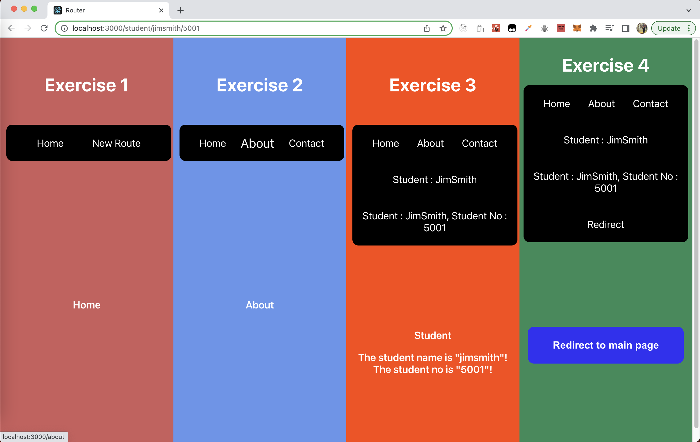

# React-Router 

An example of a react application and how routing is implemented using the most popular react router package : react-router-dom

#### Instructions :

  git clone : https://github.com/suryapranesh4/React-Router.git  
  cd React-Router  
  npm install  
  npm start

## Screenshot of the application

